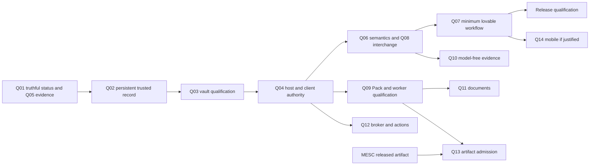

# Trusted V1 delivery decisions

Date: 2026-09-09. Status: `PLANNING_REFINEMENT_PENDING_CANONICAL_REVIEW`.
Parent: [whole-product review](WHOLE_PRODUCT_REVIEW_2026-09-09.md).

Historical CLOSED_CANONICAL states remain unchanged. The next task is preparation and
qualification of a bounded trusted-record follow-on package, not implementation of every
advanced idea. This plan does not promote all Spec 016+ work. Ordinary planning is authorized;
runtime changes require their owning Spec Kit lifecycle, exact-head review and migration plan.

## Prioritized improvement register

Costs are focused engineer-days, excluding review/device/external waiting; validate estimates
at spec preparation. Owner is the maintainer of the target spec, not an invented staff assignment.
All implementation risks require regression evidence before adoption.

| ID / area | Current state / problem | Proposed change | Priority / why now | User / architecture / security value | Cost | Dependencies / blockers | Risk | Can execute now / target |
|---|---|---|---|---|---|---:|---|---|---|
| Q01 status | CONFLICTING: root says Spec 001 next; queue closed | Point entry documents to live queue; separate scoped closure from release maturity | P0 / prevents wrong work | honest onboarding / one status authority / no fake readiness | 1 | review only | low | YES planning; root + START_HERE + queue |
| Q02 persistence | PARTIAL: in-memory assertions/evaluations/intents | Persist full object/audit lifecycle and reload; stable IDs, atomic promotion | P0 / record must survive restart | retained record / one durable authority / integrity | 8–15 | qualified follow-on spec; 002/003/005 | migration/data loss | SPEC_PREPARATION_NOW; successor to 002–006 |
| Q03 vault | PRIVACY_RISK: plaintext metadata while open | Qualify encrypted metadata backend, crash/cleanup, recovery and backup | P0 / before private-data claim | privacy / coherent store / confidentiality | 8–15 | Q02 design, 005 amendment, OS proof | crypto/storage integration | SPEC_PREPARATION_NOW; 005 follow-on |
| Q04 host | UNDERDESIGNED for hostile clients: logical IPC/leases | Authenticated peer/session, scoped capabilities, OS-exclusive writer ownership | P0 / before UI/workers | reliable concurrent access / one owner / least authority | 8–15 | Q02/Q03; platform qualification | deadlock/authorization regression | SPEC_PREPARATION_NOW; 002/006 follow-on |
| Q05 release evidence | WEAK: mutable CI refs, no protection/releases | Immutable action pins, explicit read permissions, locked builds, evidence artifacts; request owner-managed required checks | P0 / protects every change | trustworthy builds / traceable gates / supply chain | 3–5 | repo settings external; license/signing later | CI availability | YES scoped spec prep; 001/release follow-on |
| Q06 record semantics | PARTIAL: partial dates/updates insufficient | Precision-aware temporal model, amendments, explicit identity reconciliation, missingness | P1 / before usable Brief | accurate context / stable model / clinical safety | 5–10 | Q02; 004 contract migration | changed projections | SPEC_PREPARATION_NOW; 004 follow-on |
| Q07 first workflow | PRODUCT_RISK: scaffold desktop | Restartable import-review-timeline-export-backup journey; stable CLI errors | P1 / first actual value | daily use / shared facade / disclosure clarity | 8–15 | Q02–Q06; final v0 only for visual release | integration/accessibility | design/tests now; 006 follow-on |
| Q08 FHIR | INTEROPERABILITY_RISK: subset mistaken for conformance | Support matrix, validator evidence, loss-aware export/provenance | P1 / bounded claims | portable record / interchange boundary / no false validity | 4–8 | Q06; qualified validator/profile assets | mapping loss | local fixtures/spec now; 003/004/013 |
| Q09 Pack/worker | PARTIAL: fixture runtime and policy flags | Signer/trust/rollback admission + real OS sandbox before one CPU engine | P1 / prerequisite to native parsing | optional local AI / narrow runtime / containment | 10–20 | Q03/Q04; platform qualification, asset rights | native/runtime footprint | design now; runtime gated; 008 |
| Q10 evidence | WEAK beyond three-note fixture | Source-versioned local corpus, lexical+filters, freshness/retraction/conflict | P1 / evidence must be inspectable | usable evidence / separate relevance / avoids false authority | 5–8 | Q02/Q06; corpus rights | misleading ranking | spec/synthetic corpus now; 011 |
| Q11 documents | PARTIAL: OCR/ASR stubs | Bounded quarantine, optional Magika comparison, one qualified parser/OCR | P2 / after trusted record | source intake / isolated transforms / hostile input containment | 8–15 | Q09; licensed engines/fixtures | parser complexity | research now; engines gated; 010 |
| Q12 broker/actions | PARTIAL: fixture transport, in-memory outbox | Durable approvals/reconciliation and transport qualification before live adapter | P2 / no V1 online dependency | reliable actions / bounded egress / no duplicate effects | 10–20 | Q02/Q04; partner/auth/standards gates | external side effects | fixture design now; live NO; 013/014 |
| Q13 MESC | OPTIONAL_DEFERRED | Complete artifact verifier contract without upstream coupling; MESC never a core/completion/release gate | P2 / preserve independence | optional model / artifact boundary / supply chain | 3–5 after assets | MESC release/rights + Q09 | stale or untrusted artifact | contract now; admit NO; 012 |
| Q14 mobile | DEFERRED_CORRECTLY: no apps | Validate companion/capture need; one platform proof before app | P3 / desktop value first | access/capture / shared semantics / device privacy | 15–30 per first platform | Q07; device/FFI/key/store/signing gates | second product surface | research only; 009 follow-on |
| Q15 scope | OVERDESIGN risk | Keep plugins, GraphRAG, replicas, imaging and CUDA outside V1 | P3 / avoid maintenance drag | focused UX / smallest design / smaller attack surface | 1 review | evidence to reopen | opportunity delay | YES deferral; 016+ |

No improvement is assigned `CAN_RUN_NOW` for real patient data or external effects.
P0 items are prerequisites to private-data/release readiness, not assertions of an active incident.

## Dependency graph and states

**Critical path:** status/evidence → persistent record → vault protection/recovery → host
ownership → temporal/identity semantics → user workflow → release qualification. Security,
accessibility and recovery acceptance start at each boundary, not in a final hardening phase.

| State | Work |
|---|---|
| CAN_RUN_NOW | planning corrections, bounded follow-on specification, synthetic review fixtures |
| PARALLELIZABLE | read-only source research, UX task design, support/coverage inventory |
| OPTIONAL_MESC_LANE | Spec 012 artifact admission only; never core, completion, or release blocking |
| BLOCKED_BY_EXTERNAL_STANDARD | selected partner profiles/terminology not qualified; no invented NPHIES mapping |
| BLOCKED_BY_PLATFORM | OS key custody, cross-process ownership, sandbox, mobile/installer qualification |
| BLOCKED_BY_UI | final visual release only; backend and fixture integration can proceed |
| BLOCKED_BY_PARTNER | live SMART/EHR/NPHIES endpoint/account/workflow acceptance |
| BLOCKED_BY_AUTHORIZATION | PHI, production effects, signing/store actions, repository settings and legal acceptance |
| DEFERRED | full mobile replicas, sync/CRDT, plugins, imaging/genomics, vector/graph servers, custom CUDA |

Q02 includes the minimum OS-exclusive writer lock needed for durable-store integrity. Q04
builds authenticated host/client capabilities on that primitive; it is not a prerequisite
cycle for Q02. Q10 lexical evidence needs Q02/Q06, not a model worker.

Platform qualification is engineering work plus measured host evidence, not automatically a
founder-only external gate. Preserve the existing gate until proof exists, but do not classify
ordinary implementation gaps as permission to stop the whole project.

## Version scope

V1: the model-free longitudinal workflow, desktop/CLI, local import/export, backup/recovery,
qualified privacy, clear limitations and accessible integrated UI. Synthetic preview may
precede a private-data release; label the distinction everywhere.
V1.5: source-versioned evidence and one confined local capability; optional read-only SMART
only if qualified. V2: measured document intelligence and carefully selected controlled
integrations. LONG_TERM: justified mobile/adapter ecosystem. RESEARCH_ONLY: new inference,
quantization and retrieval hypotheses. REMOVE from the active product promise: blanket
feature parity, automatic clinical authority and unsupported compliance/safety claims.

## Performance and reliability acceptance

Proposed budgets, to freeze against a specified Windows/Linux machine and synthetic corpus:
cold model-free launch p95 ≤2 s; timeline for 10,000 events p95 ≤250 ms; lexical search over
10,000 local records p95 ≤300 ms; 1 MiB bounded FHIR ingest p95 ≤500 ms excluding external
validation; UI interaction response ≤100 ms and smooth scrolling; model-free idle memory
≤250 MiB. Measure 30 runs after explicit warmup, report p50/p95 and peak memory with hardware,
toolchain, lock and dataset hashes. Do not claim these targets are achieved. OCR/inference
budgets are workload-specific and do not drive hardware dependencies in V1.

Recovery contracts must cover partial metadata/blob commits, migration interruption, corrupted
backup, crashed worker, missing Pack, failed OCR, wrong keys, expired credentials, clock rollback
and uncertain effects. Detect before canonical visibility, preserve diagnostic reason codes,
and use verified backups/replay where possible. Never silently create an empty replacement
vault, mark unavailable validation as pass, or turn UNKNOWN into a safe retry.

## Test and release strategy

Retain existing tests and add high-value boundary evidence in owning specs: real process
restart; independent writer contention; lossless source round-trip; temporal/property tests;
transaction/migration fault tests; complete vault lifecycle marker checks; parser/manifest/IPC
bounded fuzzing; differential FHIR validation; network-disabled runtime tests; external-action
state-machine and reconciliation tests; package installation/upgrade/rollback and accessibility.
Use synthetic owned fixtures. Fuzzing of third-party exploit corpora is not part of this plan.

`RELEASE_READY` requires an immutable source/tree and lock, qualified OS matrix, all mandatory
CI/reviews, reproducible package contents, SBOM including native/model assets, rights/license
decision, checksums/provenance/signing verification, migration and recovery proof, source-linked
claims/limitations and no unresolved material findings. Current state is FALSE.
Windows and Linux have baseline CI only; macOS unqualified; iOS/Android scaffold only.
Never infer app readiness from host-independent Rust tests or a doctor enum.

## Decision records

| Decision | Alternatives | Evidence / selection | Risk / reversibility / exit |
|---|---|---|---|
| Preserve Rust core and domain model | FHIR DB or imported donor model | constitution; distinct authority types already exist | low churn; adapters preserve export escape hatch |
| Finish model-free record first | AI/mobile/action breadth first | in-memory state, desktop scaffold, no release | delays breadth; reversible prioritization based on user evidence |
| Keep one metadata+blob design | graph/vector/server fleet | existing SQLite/blob structure | migration risk; versioned exports and store interface exit |
| Qualify encrypted metadata before PHI | accept sealed-at-close as sufficient | working file observed; 005 amendment | native dependency/build cost; prototype within existing one-SQLite rule |
| Keep Pack and MESC artifact-first | source checkout/import/shared service | current 012 denial and independent upstream | artifact wait; alternative qualified Packs keep core useful |
| Conditional Tauri | native shell by fiat or unconditional WebView | current v0 contract; capability/privacy limits | platform evidence cost; portable view contract allows shell replacement |
| No advanced 016+ capability promotion now | promote all deferred features | no measured first-workflow value | delay; reconsider one bounded spec on new evidence |

These decisions refine implementation priorities without changing constitutional invariants.
Any irreversible runtime choice is ratified in its owning spec/research/ADR before code.
