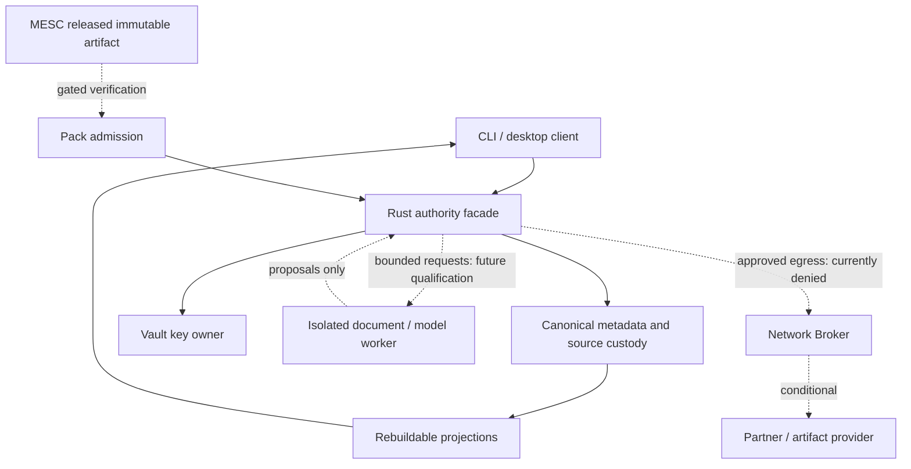

# MedScale trust and privacy model

Date: 2026-09-09. Source baseline: `b49592c83d23542363f671afe6a9ae65fc65b276`.
Scope: actual local product code and conditional future boundaries. Source-backed architecture
review, not a penetration test or exhaustive vulnerability audit. No real PHI is authorized.

## Overview

The current CLI owns a transient in-process CoreFacade. Desktop is a non-WebView scaffold.
The intended authenticated Core Host, isolated workers and native mobile apps are not yet
established runtime boundaries. A separate fresh-context architecture review checked the
source; material resource facts were checked again against their consumers.

| Component | Placement | Source evidence |
|---|---|---|
| contracts, authority, identity/promotion | TRUSTED_CORE | `crates/medscale-core/src/authority/facade.rs:28`, `crates/medscale-core/src/authority/promote.rs:11` |
| storage and keys | TRUSTED_CORE, narrow native SQLite dependency | `crates/medscale-storage/src/encrypted_vault.rs:155`, `crates/medscale-keys/src/provider.rs:84` |
| timeline/Brief/search indexes | PROJECTION_ONLY | `crates/medscale-core/src/authority/presentation.rs:97`, `crates/medscale-core/src/authority/retrieval.rs:50` |
| fixture model / OCR / ASR outputs | ADVISORY_ONLY, currently in-process | `crates/medscale-pack/src/runtime.rs:24`, `crates/medscale-core/src/authority/document_ops.rs:124` |
| future native model/document processes | SANDBOXED_COMPONENT / BOUNDED_WORKER, not qualified | `crates/medscale-contracts/src/os_sandbox/mod.rs:121` |
| network broker | Trusted policy boundary; fixture transport only | `crates/medscale-core/src/authority/facade.rs:651`, `crates/medscale-network/src/transport.rs:26` |
| SMART/NPHIES/HF/MESC producer | EXTERNAL_SERVICE / artifact producer; live integration gated | `crates/medscale-core/src/authority/facade.rs:893` |
| UI and future mobile | Untrusted client presentation; not clinical authority | `crates/medscale-desktop/src/main.rs:1`, `crates/medscale-contracts/src/mobile/mod.rs:49` |

Dashed paths describe intended, gated functionality. This diagram is not evidence of OS
confinement. The current facade is an internal trusted-process API, not an authenticated IPC server.

### Effective resources

| Deployment or workflow | Resource / capability | Configuration and precedence | Effective location | Readers / writers | Enforcing control / limit |
|---|---|---|---|---|---|
| CLI synthetic vault | source metadata/blobs | explicit root argument through CliSession | `<root>/meta.sqlite3`, `<root>/blobs/<digest>` | core process/host filesystem | digest checks; synthetic scope; `crates/medscale-storage/src/sqlite_meta.rs:45`, `crates/medscale-storage/src/blob.rs:33` |
| CLI encrypted vault | working metadata | explicit root; facade opens EncryptedVault | `<root>/meta.work.sqlite3` | unlocked process/host filesystem | plaintext while open; no claim of full-tree ciphertext; `crates/medscale-storage/src/encrypted_vault.rs:161,209` |
| Closed encrypted vault | header/metadata/blobs | same explicit root | `vault_header.json`, `meta.sealed`, `sealed_blobs/<digest>.sealed` | key-owning process; backup recipient gets ciphertext | AEAD sealing; close/cleanup limits; `crates/medscale-storage/src/encrypted_vault.rs:187,239` |
| Library default root | path helper | LOCALAPPDATA; otherwise platform helper fallbacks | Windows `MedScale/vaults/<id>`; other OS data directory | caller must actually use helper | not the CLI argument precedence; `crates/medscale-storage/src/encrypted_vault.rs:364` |
| Key unlock | passphrase/recovery / optional store | CLI named environment variable; library KeyProvider | process environment/memory; optional keystore payload | local account/process | no secret argv; MemoryKeyStore is mock; `crates/medscale-cli/src/main.rs:234`, `crates/medscale-keys/src/keystore.rs:46` |
| Backup | sealed copy | explicit destination | header/meta.sealed/sealed_blobs copy | operator-chosen recipient | restore integrity and location qualification still required; `crates/medscale-storage/src/encrypted_vault.rs:278` |
| Writer ownership | file marker + in-memory lease | supplied holder string | `<root>/.writer.lock`, instance-local registry | trusted process | not qualified OS-exclusive lock; `crates/medscale-storage/src/encrypted_vault.rs:227`, `crates/medscale-core/src/process/mod.rs:20` |
| Broker | request receipt | facade chooses FixtureTransport | in-memory synthetic response | core caller | no socket; live transport refuses; `crates/medscale-network/src/transport.rs:48` |
| Action outbox | intents/audit | CoreFacade store + Spec 016 `authority_objects` when SyntheticVault open | memory-only without open vault; Spec **034** qualifies SyntheticVault restart reload of audit-class intents / ListOutbox | trusted process | no live-partner guarantee; EncryptedVault authority sync not Spec 034; `crates/medscale-core/tests/outbox_restart_034.rs` |

Paths are relative to the repository root at the recorded baseline. These describe actual
consumers rather than assumed deployment defaults.

Default helper precedence: Windows uses `%LOCALAPPDATA%/MedScale/vaults/<id>`, falling
back to `./MedScale/vaults/<id>`. Other platforms use `$XDG_DATA_HOME/medscale/vaults/<id>`,
then `$HOME/.local/share/medscale/vaults/<id>`, then `./medscale/vaults/<id>`. The CLI uses
its explicit root argument. The facade passes no optional keystore; the optional KeyProvider
implementation stores wrapping key and sealed DEK together, so protection relies on the
keystore access boundary (`crates/medscale-keys/src/provider.rs:209`).

## Threat model, trust boundaries and assumptions

Assets: original sources, attributed assertions/identity, key material, complete audit history,
disclosure/action authority, Pack identity and confidentiality of record-derived information.
Actors: an operator; a future lower-trust UI/worker; an untrusted local import supplier;
an artifact provider; a future network peer. Do not assume a remote listener exists or an
attacker already has the operator account or DEK. Host-admin compromise is outside a promise
of application-only isolation, but crash remnants and accidental disclosure remain relevant.

Current controls: distinct object types; scope-checked reads; explicit promotion; lexical
input bounds; source hashing; sealed files; denied live integrations. Important limits:

- `crates/medscale-core/src/authority/facade.rs:76–106` checks that a lease exists and that capability matches request type;
  it does not authenticate a hostile client's identity. Never expose it directly as IPC.
- `crates/medscale-storage/src/claim.rs:19` rejects parent traversal and known sync-name markers, but that does not
  establish filesystem ownership, canonical paths, reparse/symlink containment or ACLs.
- `crates/medscale-storage/src/encrypted_vault.rs:209–223` writes plaintext working metadata. The marker-check helper
  at line 337 examines sealed artifacts, so it cannot prove absence from the whole vault tree.
- `crates/medscale-contracts/src/os_sandbox/mod.rs:121` refuses application even when a caller marks a plan qualified.
  This is an appropriate deny path, not proof of a confined running worker.
- `crates/medscale-core/src/effects/mod.rs:7` and `crates/medscale-core/src/authority/facade.rs:855` implement fixture action semantics; nonempty
  reconciliation text is not independent evidence of an external outcome.

Preserve invariants: source bytes never change; AI output never auto-promotes; missing data
never means absence; explicit attribution never guarantees medical truth; scope survives all
links/exports; every disclosure requires authority; UNKNOWN never authorizes retry; unavailable
protection means unavailable capability. No product telemetry or remote crash upload by default.

## Attack surface, mitigations and conditional scenarios

The rows are defensive threat scenarios, not validated exploit findings. P0 here means a
release-blocking priority for the proposed private-data product, not current remote exploit severity.

| Priority / asset | Actor / entry / boundary | Threat and impact | Existing controls | Mitigation | Detection / recovery |
|---|---|---|---|---|---|
| P0 record confidentiality | local data recipient / unlocked vault / storage | working metadata or crash residue disclosed | sealed artifacts, synthetic-only operation | qualified encrypted metadata backend, secure temp policy, complete lifecycle handling | whole-tree synthetic marker scans; quarantine interrupted state; restore verified backup |
| P0 record integrity | concurrent client / open vault / writer | inconsistent ownership or lost updates | instance/file marker leases | OS-exclusive lease and transactional identity/persistence | two-process tests and crash recovery; no blind stale-lock deletion |
| P0 authority | future UI or worker / IPC / host | caller impersonation or scope confusion | internal type checks and scope reads | peer-authenticated session, issued capability bound to vault/principal/scope/expiry | authorization denials; revoke session; rebuild projections from intact log |
| P0 recovery | crash/power loss / mutation / metadata+blobs | accepted data or audit disappears on restart | source metadata and blob tests | transactional persistent object/audit state with journal-aware backup | restart/fault tests; verify manifests and recover without overwriting evidence |
| P0 supply chain | compromised dependency/update / installer or Pack / admission | untrusted code or artifact becomes trusted | lockfile, cargo-deny, format/hash checks | reviewed immutable pins, publisher trust, revocation/rollback policy, signed release | SBOM/advisory checks; reject/revoke artifact; restore last qualified version |
| P1 hostile source | file supplier / FHIR/doc intake / parser | malformed content exhausts resources or influences output | 1 MiB / depth-64 FHIR limit; MIME deny paths | bounded parsing, quarantined native workers; model-independent source validation | bounded fuzz/property tests; cancel worker, retain permitted quarantine receipt |
| P1 inference | document/provider / retrieved text / model | content masquerades as instructions or clinical fact | proposal-only fixture path | separate data from instructions, minimum context, evidence checks; no action tools by default | unsupported-claim/abstention suite; invalidate proposal without altering source |
| P1 egress | future peer/adapter / broker / network | redirection or metadata leakage | actual live transport denied | explicit URL/DNS/TLS/redirect/secret policy; budgets and purpose receipts | egress observation; deny/revoke grant and reconcile uncertain write |
| P1 external effect | future client / action intent / partner | duplicate or unauthorized operation | gated NPHIES; UNKNOWN vocabulary | durable approved intent and verified result, idempotency and classified retry | outbox/reconciliation inspection; never auto-resend UNKNOWN |
| P1 display | imported narrative/v0 code / UI / core | unsafe rendering, cache or clipboard leak | no real UI yet | escaped inert source rendering, minimal capabilities, no remote content/storage plugins | synthetic UI leak checks; clear authorized cache, lock view, revoke client |
| P2 mobile | device loss / backup/notifications / app | record exposure or unintended key sync | policy stubs only | hardware/store qualification, backup exclusion, lock-screen minimization | device evidence; revoke paired device; user-controlled recovery |

Detailed dynamic validation is future scoped defensive work. No exploit payload, third-party
target testing, credential extraction or autonomous offensive workflow is part of this review.

## Severity calibration

Critical would require demonstrated broad unauthorized clinical-action or sensitive-data
authority across an actual deployment boundary; no such deployed path was established.
High can describe private vault exposure or durable integrity loss once sensitive data is
in scope; current synthetic-only authorization limits present impact. Medium covers a bounded
workflow denial or recoverable confidentiality/control failure under realistic local inputs.
Low covers misleading documentation with no authority gain, though readiness misstatements
can become release-blocking when they encourage unsafe deployment. Same-process trusted code
calling an internal API is not automatically a privilege escalation. Keep confidence,
reachability and missing prerequisites separate from potential impact.

## Privacy data lifecycle

All current test data must be synthetic. This is the required future handling model; rows
explicitly distinguish current implementation from needed qualification.

| Data | Location / processor | Encryption | Retention | Network access | Exportability / deletion | Auditability |
|---|---|---|---|---|---|---|
| raw sources | local blob store / core | sealed in encrypted path; synthetic plaintext path separate | user policy + referenced-history rules | none by default | explicit scoped export; deletion includes references/backup limitations | custody digest and event |
| assertions/identity/audit | local metadata / authority | current work file plaintext; protection gap | versioned policy; amendments append | none by default | export attribution; erasure reconciles retention obligations | transactional history required |
| derived OCR/transcripts | worker output admitted by core | same sensitivity as source | transform-versioned, rebuildable where possible | denied | scoped export; invalidate parent-dependent artifacts | transform/hash/span evidence |
| retrieval indexes/vectors | local projection / bounded indexer | must inherit vault protection | rebuildable, purge with source policy | denied | not implicitly shareable; remove caches/index entries | index version/source IDs |
| prompts/AI memory | worker memory / optional cache | no persistent prompt logging by default | session-bounded; explicit opt-in cache | no remote fallback | no automatic export; clear on lock/cancel | value-free invocation receipt |
| preferences | separate scoped local settings | no clinical details in ordinary settings | until changed/deleted | denied | explicit export/reset | settings version |
| keys/recovery | key owner / qualified OS store | DEK/wrapping separation | lifecycle/revocation policy | never | explicit recovery ceremony; deletion cannot erase old backups magically | key IDs/events, never key values |
| logs/diagnostics | local bounded logs / core | exclude clinical values/secrets | proposed seven-day bounded ring | no upload | preview/redact explicit diagnostic export | reason codes/versions/digests |
| clipboard/screenshot/UI cache | OS/client | not assumed protected | minimize, lock/clear where supported | OS-dependent, disclose limits | explicit copy only; no universal screenshot/deletion promise | disclosure receipt where owned |
| backups/exports | user-chosen destination | encrypted backups; export classification explicit | caller-controlled, explain copies | no sync implied | preview recipient and content; document snapshots/SSD limitations | manifest/restore/export receipts |

Before private-data use: verify disk/temp/WAL/journal/cache/crash paths, permissions, OS key
custody, backup restore, memory/prompt behavior and actual egress on every supported platform.
Consent/legal-purpose records enable future deployment review; they do not declare compliance.
